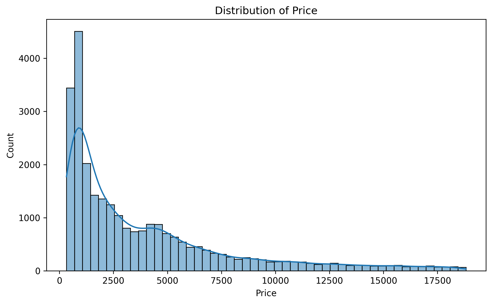
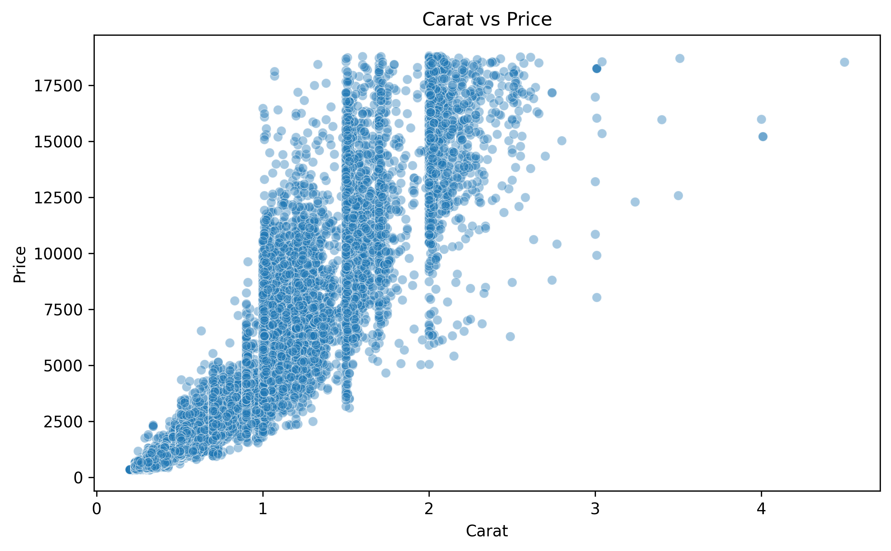
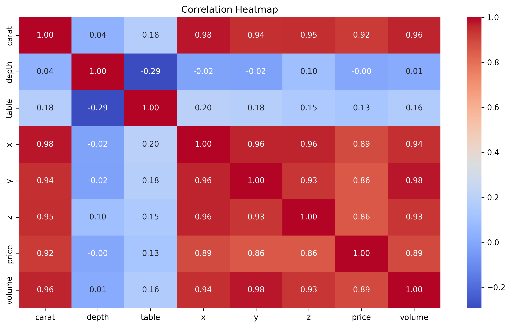
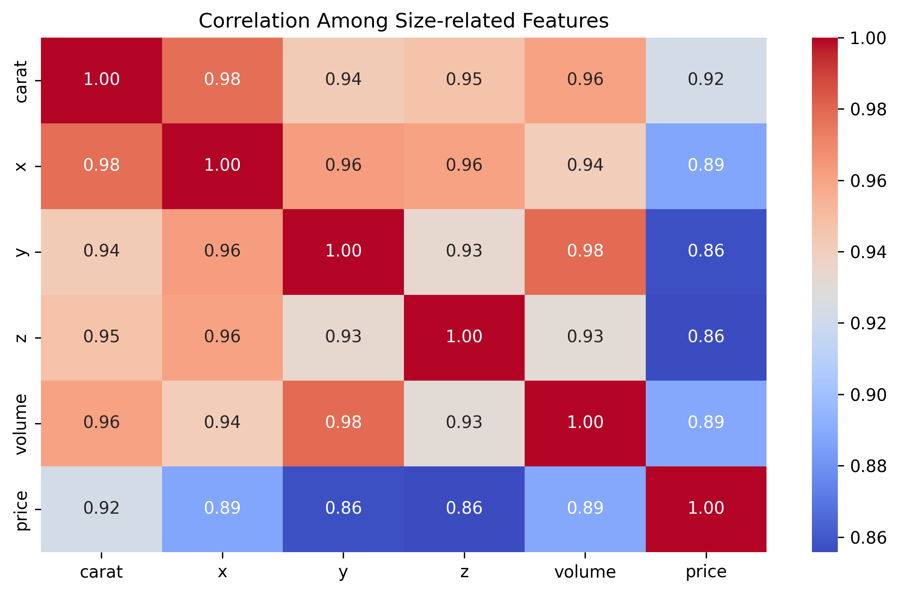
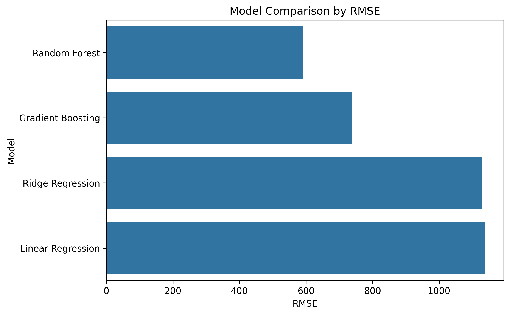
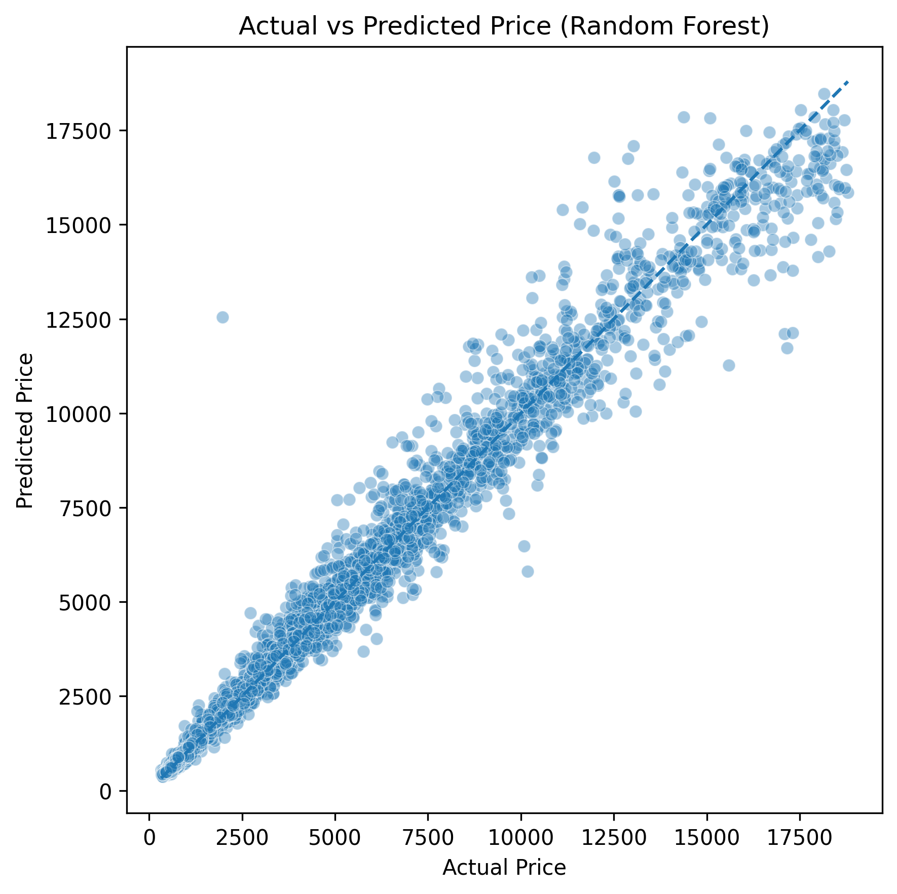
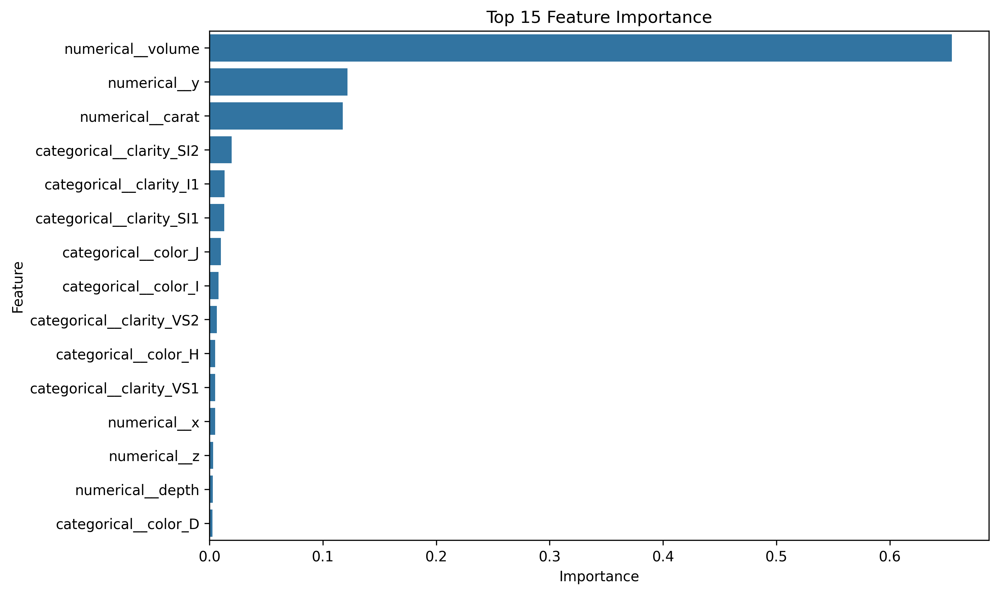

# Cubic Zirconia Price Prediction

## Project Overview

This project aims to predict cubic zirconia prices based on product attributes such as carat, cut, color, clarity, depth, table, and physical dimensions.

The project follows a complete machine learning workflow, including data loading, ETL/data cleaning, exploratory data analysis, feature engineering, model training, model evaluation, and model interpretation.

The main objective is not only to build a price prediction model, but also to understand which product characteristics are most related to price.

---

## Business Problem

Pricing gemstones can be complex because price is influenced by multiple physical and quality-related attributes. Features such as carat, dimensions, cut, color, and clarity can interact with each other in non-linear ways.

This project uses machine learning regression models to estimate cubic zirconia prices and identify the most important factors that contribute to price prediction.

---

## Dataset

The dataset contains product-level records of cubic zirconia stones.

### Key Features

| Feature   | Description                                  |
| --------- | -------------------------------------------- |
| `carat`   | Weight of the stone                          |
| `cut`     | Cut quality                                  |
| `color`   | Color grade                                  |
| `clarity` | Clarity grade                                |
| `depth`   | Depth percentage                             |
| `table`   | Width of the top facet relative to the stone |
| `x`       | Length dimension                             |
| `y`       | Width dimension                              |
| `z`       | Depth dimension                              |
| `price`   | Target variable — price of the stone         |

---

## Project Workflow

### 1. Data Loading

I loaded the raw dataset from a CSV file and performed initial checks to understand the dataset structure, including shape, data types, missing values, duplicated records, and summary statistics.

### 2. ETL and Data Cleaning

The ETL process includes:

* Extracting the raw CSV file
* Removing unnecessary index columns
* Removing duplicated records
* Handling missing values in `depth`
* Checking and removing invalid dimension values
* Creating a new `volume` feature
* Saving the cleaned dataset into `data/processed/`

### 3. Exploratory Data Analysis

I explored the cleaned dataset to understand:

* Price distribution
* Relationship between carat and price
* Correlation between numerical variables
* Price patterns across cut, color, and clarity
* Correlation among size-related features

### 4. Feature Engineering

I created a new feature:

```python
volume = x * y * z
```

This feature represents the approximate physical size of each stone.

Categorical variables such as `cut`, `color`, and `clarity` were encoded using One-Hot Encoding. Numerical features were passed directly into the model pipeline.

### 5. Model Training

I trained and compared four regression models:

* Linear Regression
* Ridge Regression
* Random Forest Regressor
* Gradient Boosting Regressor

Linear Regression and Ridge Regression were used as baseline models, while Random Forest and Gradient Boosting were used to capture more complex non-linear relationships.

### 6. Model Evaluation

Models were evaluated using:

| Metric | Meaning                                                 |
| ------ | ------------------------------------------------------- |
| MAE    | Average absolute prediction error                       |
| RMSE   | Prediction error with stronger penalty for large errors |
| R²     | Percentage of price variation explained by the model    |

The best model was selected based on RMSE, with MAE and R² used as supporting metrics.

### 7. Model Interpretation

For the best-performing tree-based model, I used feature importance to understand which variables contributed most to prediction.

Since `carat`, `x`, `y`, `z`, and `volume` are highly correlated, I interpreted them as a size/weight-related feature group rather than fully independent price drivers.

---

## Visualizations

### Price Distribution



### Carat vs Price



### Correlation Heatmap



### Size-related Feature Correlation



### Model Comparison



### Actual vs Predicted Price



### Feature Importance



---

## Key Findings

* Size and weight-related features are the strongest predictors of cubic zirconia price.
* `Carat`, `x`, `y`, `z`, and `volume` are highly correlated, so they should be interpreted as a feature group rather than fully independent drivers.
* `Carat` shows a strong relationship with price, which aligns with the expectation that heavier stones tend to have higher prices.
* Quality-related attributes such as clarity, color, and cut also contribute to price prediction, but their impact is lower compared to size-related variables in this dataset.
* Tree-based models performed better than linear models, suggesting that price is influenced by non-linear relationships between size, weight, and quality attributes.

---

## Tools and Libraries

| Category             | Tools               |
| -------------------- | ------------------- |
| Programming Language | Python              |
| Data Manipulation    | pandas, numpy       |
| Data Visualization   | matplotlib, seaborn |
| Machine Learning     | scikit-learn        |
| Model Saving         | joblib              |
| Environment          | Jupyter Notebook    |
| Version Control      | GitHub              |

---

## Repository Structure

```text
Cubic-Zirconia-Price-Prediction/
├── data/
│   ├── raw/
│   │   └── cubic_zirconia.csv
│   └── processed/
│       └── cubic_zirconia_cleaned.csv
├── outputs/
│   ├── figures/
│   └── tables/
├── cubic_zirconia_price_prediction.ipynb
├── requirements.txt
└── README.md
```

Note: The trained model file is not included in this repository due to file size. It can be regenerated by running the notebook.

---

## How to Run This Project

1. Clone or download this repository.
2. Install the required libraries:

```bash
pip install -r requirements.txt
```

3. Open the notebook:

```text
cubic_zirconia_price_prediction.ipynb
```

4. Run all cells from top to bottom.

The notebook will generate:

* Cleaned dataset
* Model comparison table
* Prediction sample
* Feature importance table
* Visualization images

---

## Project Status

Completed as a personal portfolio project for practicing:

* ETL
* Data cleaning
* Exploratory data analysis
* Feature engineering
* Regression modeling
* Model evaluation
* Model interpretation

---

## Author

**Nguyen Le Duyen Trang**

This project is created for learning and portfolio purposes.
